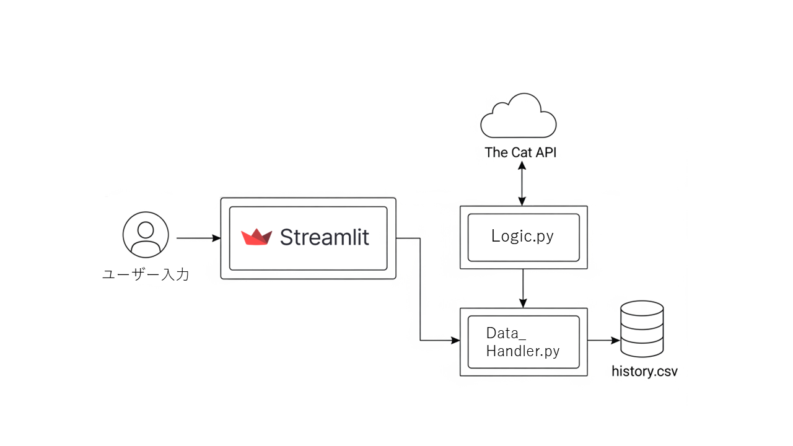
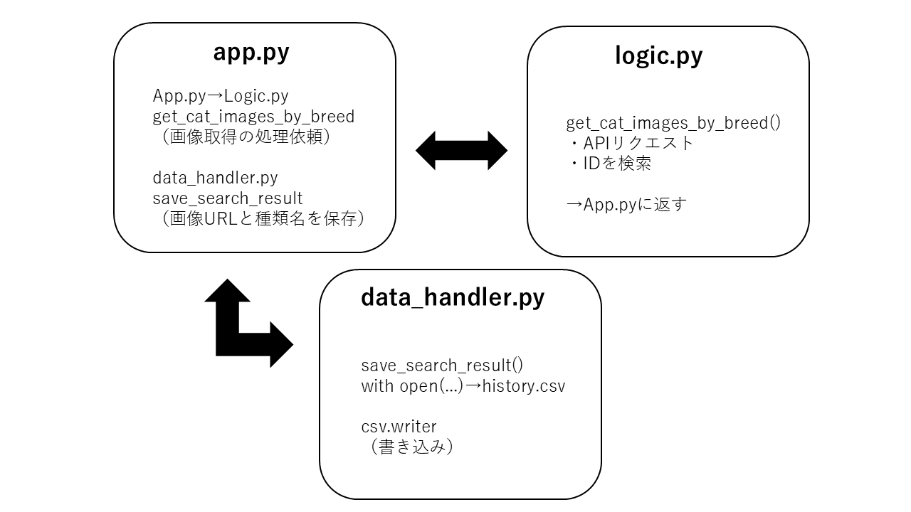

# アプリ概要
このアプリは、ユーザーによって入力された猫の種類をもとに、The Cat API を使って該当する猫の画像を検索・表示するWebアプリです。検索された画像は一時保存され、検索履歴に５枚分表示されます。

また、検索履歴は .csv ファイルとして保存され、アプリ内で一覧表示されます。

# 使用したAPI
The Cat API：猫の種類を指定して画像を取得するAPI
https://thecatapi.com/

# システム設計図

# コード説明図
このアプリは、以下の3つのPythonファイルで構成されています：

- app.py：StreamlitによるUI（ユーザー入力、検索ボタン、画像・履歴表示）

- logic.py：API通信を行う処理（猫の種類に対応する画像URLの取得など）

- data_handler.py：検索履歴をCSVとして保存・読み込みする処理

